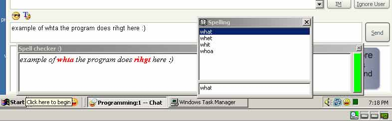



## Spell check 2\.0

### Description

Spell check any text chat window you have open, (Ex: look at screenshot). works with almost all windows. By just clicking on a windows text field it gets the hwnd and gets the text from it. If you right click on a highlighted word it can be added or it can give you suggestions. I put in a 1024 letter limit so it would not slow down while your typing, you can change it to be what ever you want in the code.

I included with this a 280.000 words file if you dont need so many words you can get a smaller word file.

Known Issues:

Doesnt work with trillian and MSN messanger. If you know how to get text from thosue programs please post the code.
 
### More Info
 

             |
---                |---
**Submitted On**   |2005-01-02 19:03:56
**By**             |[Buddy1007](https://github.com/Planet-Source-Code/PSCIndex/blob/master/ByAuthor/buddy1007.md)
**Level**          |Advanced
**User Rating**    |4.9 (49 globes from 10 users)
**Compatibility**  |VB 6\.0
**Category**       |[Complete Applications](https://github.com/Planet-Source-Code/PSCIndex/blob/master/ByCategory/complete-applications__1-27.md)
**World**          |[Visual Basic](https://github.com/Planet-Source-Code/PSCIndex/blob/master/ByWorld/visual-basic.md)
**Archive File**   |[Spell\_chec183645132005\.zip](https://github.com/Planet-Source-Code/buddy1007-spell-check-2-0__1-58098/archive/master.zip)

